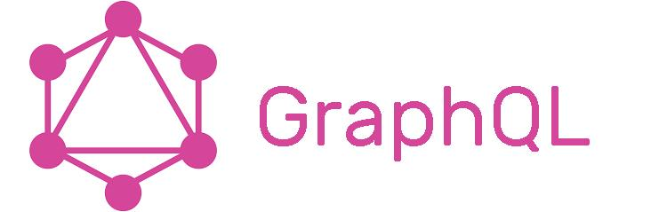

### GraphQL vs REST

***Introduzione***

Una delle tecnologia emergenti di creazione di API è mediante GraphQL, spesso referenziato in contrapposizione a REST.

Innanzi tutto, cos'è GraphQL? E in che si differenzia da REST?

Se vogliamo dare una definizione, possiamo dire che GraphQL è contemporanemente sia un *linguaggio di query,* sia un *runtime server* che un insieme di specifiche.

E' stato sviluppato originariamente da Facebook ed è open source, attualmente supportato da una community. Può essere integrato su moltissimi framework, grazie a librerie di terze parti.

Al di la della definizione, per entrare meglio nell'argomento partiamo da un esempio di una applicazione sviluppata mediante API REST, per poi confrontarla con una analoga mediante GraphQL.

***Esempio REST***

Supponiamo di voler gestire un'applicazione di messaggistica mediante delle API REST. Se volessimo ottenere la lista dei messaggi pubblicati, coi relativi autori, dovremmo effettuare delle chiamate del tipo:

```http
GET /messages
```

e otterremmo qualcosa del tipo

```json
[
     {
       "id_message": "7f612bc79dfa32e61378",
       "content": "My first message",
       "id_author": "7a24e0ba72a437632985"
     },
     {
       "id_message": "1cb35981b9e6238f682e",
       "content": "My second message",
       "id_author": "7a24e0ba72a437632985"
     },
     {
       "id_message": "3ec3aea897efc14ea6d1",
       "content": "This is a new message",
       "id_author": "2011eb90c6efe82efbd9"
     }
]
```

Se volessimo ottenere la lista dei rispettivi autori dovremmo effettuare due chiamate

```http
GET /authors/7a24e0ba72a437632985
GET /authors/2011eb90c6efe82efbd9
```

E otterremmo qualcosa del tipo per la prima:

```json
{
    "id_author": "7a24e0ba72a437632985",
    "name": "Bob",
    "age": 30,
    "nationality": "English"
}
```

E per la seconda

```json
{
    "id_author": "2011eb90c6efe82efbd9",
    "name": "Martin",
    "age": 45,
    "nationality": "French"
}
```

Come possiamo notare abbiamo dovuto effettuare tre chiamate distinte, a due endpoint diversi. Il client quindi deve elaborare le informazioni ricevute per ottenere quanto richiesto e si avrebbe quindi necessità di una logica lato client.

Questa è una caratteristica delle API REST, in quanto tale recnologia opera per **risorse** e mediante una interfaccia ben definita concordata tra client e server.

E se avessimo bisogno di aggiungere un campo, ad esempio le lingue parlate da ogni autore? Dovremmo modificare l'interfaccia e le implementazioni sia del client che del server.

***Esempio GraphQL***

Il precedente esempio implementato mediante GraphQL sarebbe più semplice e flessibile, effettuato con una unica chiamata :

```graphql
query {
  listMessages() {
    id_message
    content
    author {
      id_author
      name
      age
      nationality
    }
  }
}
```

E la risposta :

```json
[
      {
        "id_message": "7f612bc79dfa32e61378",
        "content": "My first message",
        "author": {
          "id_author": "7a24e0ba72a437632985",
          "name": "Bob",
          "age": 30,
          "nationality": "English"
        }
      },
      {
        "id_message": "1cb35981b9e6238f682e",
        "content": "My second message",
        "author": {
          "id_author": "7a24e0ba72a437632985",
          "name": "Bob",
          "age": 30,
          "nationality": "English"
        }
      },
      {
        "id_message": "afe1e63e3d02535082a5",
        "content": "This is a new message",
        "author": {
          "id_author": "2011eb90c6efe82efbd9",
          "name": "Martin",
          "age": 45,
          "nationality": "French"
        }
      }
]
```

E se volessimo avere un campo in più per ogni autore, come le lingue parlate?

Si dovrebbe solo modificare la chiamata aggiungendo il campo *languages*, senza alcuna necessità di modificare le implementazioni :

```graphql
query {
  listMessages() {
    id_message
    content
    author {
      id_author
      name
      age
      nationality
    languages
    }
  }
}
```

Uno degli svantaggi di REST, che è un protocollo basato su risorse, è quello di avere la necessità di eseguire query multiple per recuperare diverse porzioni di dato, provenienti eventualmente da sorgenti diverse, che poi dovranno eventualmente essere elaborate dal client stesso prima di poterle utilizzare.

Con GraphQL invece, essendo un linguaggio di query, è possibile recuperare i dati con un'unica chiamata in maniera che siano già predisposti per il consumo diretto da parte del client (si pensi ad esempio applicazioni frontend), che quindi potranno semplificare la loro logica.

Questa caratteristica risulta particolarmente vantaggiosa in un contesto dinamico e distribuito, come ad esempio quello dei microservizi esposti in un ambiente cloud e fruibili da diverse applicazioni.


***Schemi***

Abbiamo detto che con GraphQL non ha un'interfaccia di colloquio prestabilita tra client e server. In GraphQL infatti è il *client* comunica al server lo ***schema*** con cui intende colloquiare, e quindi la struttura dei dati che verranno utilizzati in I/O.

Gli schemi definiscono gli oggetti, i relativi campi e i tipi di dato che saranno utilizzate sia nelle query e nelle relative risposte da parte del server.

Questo permette una maggiore flessibilità rispetto a REST e consente, ad esempio, di aggiungere o disattivare campi senza modificare le query già esistenti, continuando a garantire il funzionamento dell'applicazione client.

Inoltre lo schema consente alla componente *server* di GraphQL di validare i dati ricevuti e, nel caso di incongruenze, di ritornare un opportuno messaggio di errore.

Per ogni campo contenuto nello schema il server implementa una funzione *resolver*, che consente di determinare il valore del campo da restituire al client.

Ovviamente, questa flessibilità di GraphQL è frutto del fatto che parte della logica di elaborazione dei dati, e quindi della complessità dell'applicazione, è stata spostata dal client al server.


***Query e mutazioni***

Con GraphQL il client puo eseguire **query** e **mutazioni**.

Per fare una analogia con lo schema CRUD (*create, read, update, delete*), le query corrispondono alle READ, mentre le mutazioni alle CREATE, UPDATE e DELETE.

Per ricollegarci all'esempio precedente, recuperare un messaggio si può eseguire la seguente query, dove dobbiamo indicare l'identificativo del messaggio da ricercare :

```graphql
query {
  getMessage(id_message : "<message_id>") {
    content
    author {
      id_author
      name
    }
  }
}
```

In questa query viene indicato lo *schema* con cui vogliamo ottenere la risposta :

```graphql
{
    content
    author {
      id_author
      name
    }
}
```

In base a tale schema, esempio di risposta sarà :

```json
{
     "content": "My first message",
     "author": {
       "id_author": "53a944846769511c884f",
       "name": "Bob"
     }
}
```

Per recuperare tutti i messaggi di un determinato utente :

```graphql
query {
  listMessages(author_name : "Bob") {
    id_message
    content
    author {
      id_author
      name
      age
      nationality
    }
  }
}
```

In questo caso lo schema è

```graphql
{
    id_message
    content
    author {
      id_author
      name
      age
      nationality
    }
}
```

e quindi una possibile risposta:

```json
[
      {
        "id_message": "7f612bc79dfa32e61378",
        "content": "My first message",
        "author": {
          "id_author": "7a24e0ba72a437632985",
          "name": "Bob",
          "age": 30,
          "nationality": "English"
        }
      },
      {
        "id_message": "1cb35981b9e6238f682e",
        "content": "My second message",
        "author": {
          "id_author": "7a24e0ba72a437632985",
          "name": "Bob",
          "age": 30,
          "nationality": "English"
        }
      }
]
```

Riguardo alle mutazioni, per creare un nuovo messaggio :

```graphql
mutation {
  createMessage(input: {
    content: "My first message",
    author: {
      name : "Bob",
      age: 30,
      nationality: "English"
    }
  }) {
    id_message
    content
    author {
      age
      nationality
    }
  }
}
```

Lo schema con cui vogliamo ottenere risposta alla mutazione è :

```graphql
{
    id_message
    content
    author {
      age
      nationality
    }
  }
}
```

E quindi otterremo :

```json
{
      "id_message": "2011eb90c6efe82efbd9",
      "content": "My first message",
      "author": {
        "age": 30,
        "nationality": "English"
      }
}
```

Per modificare un messaggio, un\'altra mutazione :

```graphql
mutation {
  updateMessage(id_message : "<message_id>", content: "New message") {
    id_message
    content
    author {
      id_author
      age
    }
  }
}
```


***Confronto***

Se vogliamo fare un confronto tra GraphQL e REST, è utile elencare i vantaggi e svantaggi di entrambi.

###### REST

*Vantaggi*

- Il caching dei dati è agevole in quanto si effettua sul path della risorsa

- Il disaccoppiamento tra client e server favorisce la scalabilità

- Possibilità di restituire diversi tipi di dato (es: binario, testo, video)

- Gestione degli errori più semplice, in quanto si basa sugli codici di ritorno http

*Svantaggi*

- Sono presenti più endpoint, uno per ogni risorsa. Il client deve effettuare chiamate multiple a diverse risorse per ottenere spesso dati anche ridondanti che dovrà poi rielaborare
- Nel caso siano presenti più versioni della stessa API è necessario raddoppiare gli endpoint, ognuno dei quali dovrà avere un riferimento alla versione (es: `/myApi/v1/messages e /myApi/v2/messages`)

###### GRAPHQL

*Vantaggi*

- Non avendo una struttura rigida, permette una flessibilità sui dati che vengono ritornati, adattandosi bene alle esigenze dei clienti

- Utilizza un unico endpoint per tutte le chiamate

*Svantaggi*

- Se le query contengono riferimenti circolari (es: *utente -\> amici -\> utenti...*) è possibile consumare notevoli risorse sul server (o anche portare ad attacchi DDoS), per cui è opportuno prendere delle precauzioni

- Per applicazioni semplici viene aggiunta una complessità non necessaria e non presente utilizzando chiamate REST

- Il caching dei dati non è agevole, e potrebbe comportare un aumento di traffico di rete e di elaborazioni lato server

- Non è un semplice cambio di protocollo, ma implementa un nuovo paradigma di comunicazione client-server, per cui è necessaria una adeguata formazione


**Conclusioni**

GraphQL è una tecnologia emergente interessante che può essere una alternativa da prendere in considerazione rispetto al protocollo REST. Come tutte le tecnologie è opportuno soppesare vantaggi e svantaggi sia in termini applicativi che architetturali, in quanto GraphQL non è adatto per tutti i contesti.

Per fare una analogia, scegliere tra REST e GraphQL è come se decidere se per un'applicazione sia più conveniente utilizzare un linguaggio ad oggetti o uno funzionale, oppure se sia preferibile un database SQL oppure noSQL.


**Riferimenti**

Il presente articolo è una panoramica introduttiva a GraphQL. Per ulteriori approfondimenti si rimanda ai seguenti riferimenti :

https://www.howtographql.com

https://graphql.org

https://www.tutorialspoint.com/graphql
